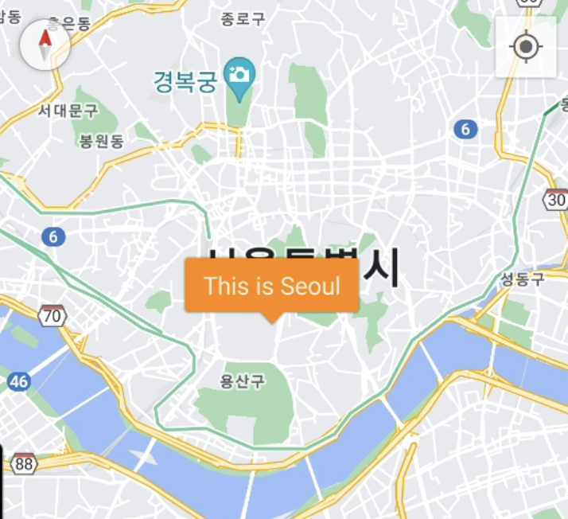
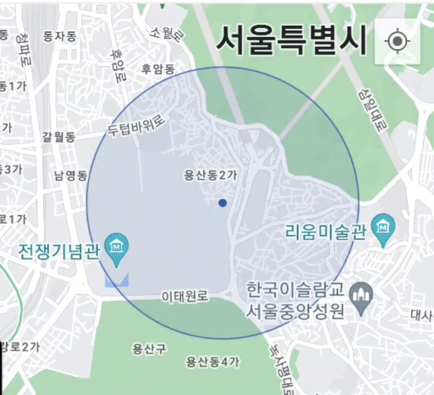

## 개요 
구글 맵은 Google Map 룰로 뷰를 지정한 후 Jevil 함수를 통해 다양한 맵 컨트롤을 하며, 콜백 메소드를 받기도 한다

## Jevil.mapAddMarker

구글 맵에 marker를 추가한다

- Jevil.mapAddMarker(node, param, function)

#### parameter

- node `string` `require` Google Map의 노드 명
- param `json` `require` 추가할 Marker 
    - key : `string` `require` 이 마커의 키값
    - lat : `double` `require` 경도
    - lng : `double` `require` 위도
    - title : `string` `optional` 마커 이름
    - desc : `string` `optional` 마커 설명
    전달될 결제 가격
    - draggable : `bool` `optional` 드래그 가능여부
    - type : `string` `optional` 마커 타입, [normal|burble] buble일 경우 title이 마커에 바로 보이게 된다. default는 normal이며, 일반적인 화살표 마커이다
    - color : `string` `optional` bubble 마커일 경우 이 마커의 말풍선 색깔 
    [blue|white|red|green|purple|orangle|default]
- callback `function` `require` 
    - 지금은 안쓰인다

#### Example code
```javascript
Jevil.mapAddMarker('map', {
    key:'1',
    lat:-33.852,
    lng:151.211,
    title:'This is Sydney',
    desc:'bla bla bla',
  }, function(res) {
    
  }) 
```


#### Example code
```javascript
Jevil.mapAddMarker('map', {
    key:'2',
    lat:37.541,
    lng:126.906,
    title:'This is Seoul',
    type:'bubble',
    color:'orange',
  }, function(res) {
    
  }) 
```

```javascript
Jevil.mapAddMarker('map', {
    key:'2',
    lat:37.541,
    lng:126.906,
    title:'This is Seoul',
    type:'image',
    url:'http://',
  }, function(res) {
    
  }) 
```




## Jevil.mapUpdateMarker

구글 맵에 marker 갱신한다(Upsert)
기존에 마커가 있다면 지우고 새로 만든다
param 의 용도는 Jevil.mapAddMarker와 같다
기존 마커의 기준은 param.key값으로 식별된다
기존 마커를 drag 가능하게 만들 수 도 있다

- Jevil.mapUpdateMarker(node, param, function)

#### parameter

- node `string` `require` Google Map의 노드 명
- param `json` `require` 추가할 Marker 
    - key : `string` `require` 이 마커의 키값
    - lat : `double` `require` 경도
    - lng : `double` `require` 위도
    - title : `string` `optional` 마커 이름
    - desc : `string` `optional` 마커 설명
    전달될 결제 가격
    - draggable : `bool` `optional` 드래그 가능여부
    - type : `string` `optional` 마커 타입, 
    [normal|burble] buble일 경우 title이 마커에 바로 보이게 된다. default는 normal이며, 일반적인 화살표 마커이다
    - color : `string` `optional` bubble 마커일 경우 이 마커의 말풍선 색깔 
    [blue|white|red|green|purple|orangle|default]
- callback `function` `require` 
    - 지금은 안쓰인다

#### Example code
```javascript
Jevil.mapUpdateMarker('map', {
    key:'1',
    lat:-33.852,
    lng:151.211,
    title:'This is Sydney',
    desc:'bla bla bla',
    draggable:true,
  }, function(res) {
    
  }) 
```


## Jevil.mapRemoveMarker

구글 맵에 marker 삭제한다
기존 마커의 기준은 param.key값으로 식별된다

- Jevil.mapRemoveMarker(node, key)

#### parameter

- node `string` `require` Google Map의 노드 명
- key : `string` `require` 이 마커의 키값


#### Example code
```javascript
Jevil.mapRemoveMarker('map', '1')

```


## Jevil.mapAddCircle

구글 맵에 서클을 추가한다
지오펜스와 같은 것을 맵에 표현하고 싶을때 쓴다

- Jevil.mapAddCircle(node, param, function)

#### parameter

- node `string` `require` Google Map의 노드 명
- param `json` `require` 추가할 서클
    - key : `string` `require` 이 서클의 키값
    - lat : `double` `require` 경도
    - lng : `double` `require` 위도
    - radius : `string` `optional` 서클의 반경(km)
- callback `function` `require` 
    - 지금은 안쓰인다

#### Example code
```javascript
Jevil.mapAddCircle('map', {
    key:'circle1',
    lat:-33.852,
    lng:151.211,
    radius:4,
  }, function(res) {
    
  }) 
```


## Jevil.mapRemoveCircle

구글 맵에 circle을 삭제한다
기존 서클의 기준은 param.key값으로 식별된다

- Jevil.mapRemoveCircle(node, key)

#### parameter

- node `string` `require` Google Map의 노드 명
- key : `string` `require` 이 서클의 키값


#### Example code
```javascript
Jevil.mapRemoveCircle('map', 'circle1')

```


## Jevil.mapCamera

구글 맵에 circle을 삭제한다
기존 서클의 기준은 param.key값으로 식별된다

- Jevil.mapCamera(node, param, function)

#### parameter

- node `string` `require` Google Map의 노드 명
- param `json` `require` 이동시킬 카메라위치
    - lat : `double` `require` 경도
    - lng : `double` `require` 위도
    - zoom : `int` `optional` zoom 수준, 없으면 현재 zoom 수준을 따른다
    - animation : `boolean` `optional` 카메라 이동시킬때 에니메이션 여부
- callback `function` `require` 
    - 지금은 안쓰인다

#### Example code
```javascript
Jevil.mapCamera('map', {
    lat:-33.852,
    lng:151.211,
    zoom:4,
  }, function(res) {
    
})

```


## Jevil.mapCallback

구글 맵에 circle을 삭제한다
기존 서클의 기준은 param.key값으로 식별된다
마커를 클릭하거나, 맵을 이동시키거나, 맵을 클릭하거나 등에 따라 콜백함수를 등록한다
- Jevil.mapCallback(node, event, function)

#### parameter

- node `string` `require` Google Map의 노드 명
- event `string` `require` 콜백을 받을 이벤트
 [click|map_click|camera|drag_start|drag_end]
- callback `function` `require` 콜백 함수 click이나 drag_start, drag_end일때는 addMarker했던 json이 그대로 res에 오며, map_click이나 camera일 경우 다음과 같은 현재 카메라관련 변수가 온다
    - res
        - lat
        - lng
        - zoom

#### Example code
```javascript
Jevil.mapCallback('map', 'click', function(marker) {
    data.show_detail = true
    data.detail_title = 'Marker Click'
    data.detail_text = marker.lat + ' / ' + marker.lng + '\n' + marker.title + ' ' + marker.desc
    Jevil.update()
  })
  
Jevil.mapCallback('map', 'map_click', function(res) {
    data.show_detail = true
    data.detail_title = 'Map Click'
    data.detail_text = res.lat + ' / ' + res.lng
    Jevil.update()
})
  
Jevil.mapCallback('map', 'camera', function(res) {
    data.show_detail = true
    data.detail_title = 'Camera Changed'
    data.detail_text = res.lat + ' / ' + res.lng
    Jevil.update()
})

Jevil.mapCallback('map', 'drag_start', function(marker) {
    data.show_detail = true
    data.detail_title = 'Drag Start'
    data.detail_text = marker.lat + ' / ' + marker.lng + '\n' + marker.title + ' ' + marker.desc
    Jevil.update()
})
  
Jevil.mapCallback('map', 'drag_end', function(marker) {
    data.show_detail = true
    data.detail_title = 'Drag End'
    data.detail_text = marker.lat + ' / ' + marker.lng + '\n' + marker.title + ' ' + marker.desc
    Jevil.update()
})
  
```